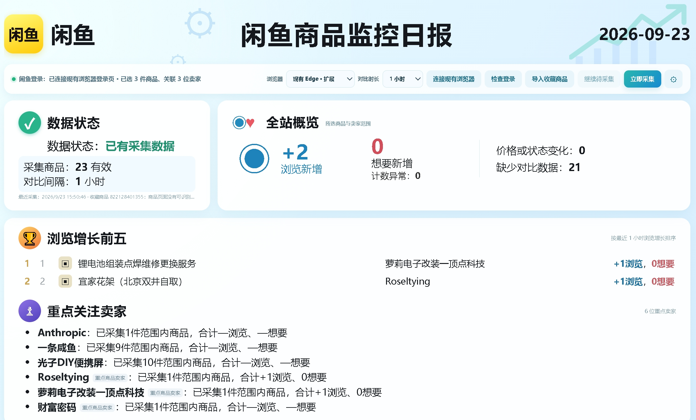

# 闲鱼商品监控日报



一个在本机运行的闲鱼收藏商品监控工具。你在自己的 Edge 或 Chrome 中登录闲鱼，从“我的收藏 → 有效宝贝”导入候选商品，手动勾选重点商品；工具读取这些商品的可见指标和卖家名字，保存快照，并生成可选时间窗口的日报。上图是界面示例，实际商品和统计结果取决于你的账号。

> 本项目不是闲鱼官方产品。它不会替你登录或绕过网页验证；遇到空白、已删除或需要验证的页面，会标明失败，不会编造指标。

## 下载与运行

当前面向 Windows 10/11。需要已安装的 Microsoft Edge 或 Google Chrome，以及 Python 3.11 或更新版本。首次运行需要联网安装 Python 依赖。已在 Windows 和 Python 3.13 上验证。

1. [直接下载 v0.1.0 Windows ZIP](https://github.com/tinyvane/20260923-XianyuDailyReport/releases/download/v0.1.0/XianyuDailyReport-v0.1.0-windows.zip)，或到 [Releases 页面](https://github.com/tinyvane/20260923-XianyuDailyReport/releases/latest)选择版本。也可以在仓库首页点 **Code → Download ZIP** 下载源码。解压完整文件夹；不要只取出 `start.bat`，扩展和网页文件也要保留在同一项目目录。[GitHub 下载说明](https://docs.github.com/en/repositories/working-with-files/using-files/downloading-files-from-github)
2. 在命令提示符运行 `python --version` 或 `py -3 --version`，确认 Python 可用。若未安装，请先安装 Python，并在安装时启用 **Add python.exe to PATH**。
3. 双击项目根目录的 `start.bat`。它会在项目内创建 `.venv`、安装依赖并打开 `http://127.0.0.1:5055/`。请保留弹出的命令窗口；关闭窗口后本机服务停止。若浏览器没有自动打开，在**已登录闲鱼的同一个浏览器**里手动打开该地址。

本项目没有预编译 EXE；发布 ZIP 内含可直接启动的源码和浏览器扩展。默认只监听本机 `127.0.0.1:5055`，无需部署服务器。

## 首次连接浏览器

推荐选择页面顶部的 **现有 Edge · 扩展**；已有 Chrome 登录会话时可选 **Chrome · 扩展**。扩展安装一次后会沿用该浏览器的登录状态。

1. 在所选浏览器打开 `edge://extensions` 或 `chrome://extensions`，开启“开发者模式”，点击“加载解压缩的扩展程序”（Edge 中为“加载解压缩的扩展”）。选择**解压后的项目目录里的 `chrome-extension` 文件夹**，也就是包含 `manifest.json` 的文件夹。[Edge 官方步骤](https://learn.microsoft.com/en-us/microsoft-edge/extensions/getting-started/extension-sideloading) · [Chrome 官方步骤](https://developer.chrome.com/docs/extensions/get-started/tutorial/hello-world#load-unpacked)
2. 在同一浏览器打开 [闲鱼官网](https://www.goofish.com/)，由你本人完成登录，然后打开“我的收藏 → 有效宝贝”。回到日报页并刷新，点击“检查登录”。
3. 若看到“扩展已就绪”但检查登录失败，确认闲鱼标签页仍登录且页面没有验证码或扫码弹窗；在扩展管理页点“重新加载”，再刷新日报页。

页面也提供 **固定 Edge** 模式。它使用项目内 `data/browser-profile/` 的独立浏览器资料，首次需要在弹出的 Edge 窗口另行登录；它与日常使用的 Edge 登录会话分开。切换模式需在页面顶部显式选择。

## 导入、选择与采集

1. 在浏览器的闲鱼“我的收藏 → 有效宝贝”页保持商品卡片可见，回到日报点击 **导入收藏商品**。每次最多导入页面已加载的 200 件官方商品链接。新导入的商品只是候选，**默认不勾选**。
2. 在“候选商品 · 勾选重点”里按名称或商品 ID 搜索，也可按“有效”“失效”“读取失败”等状态筛选。手动勾选要监控的商品；“选中当前结果”和“取消当前结果”只作用于当前筛选结果。
3. 勾选后工具会立即尝试读取该商品详情中的卖家名字和主页。确认成功的卖家自动进入“重点关注卖家”，**不需要你输入卖家 URL**。如果详情暂时打不开，勾选会保留并显示原因。
4. 点击 **立即采集**，刷新所选商品的价格、浏览量、想要量等页面可见指标。只有你另外勾选下方某位卖家的复选框，工具才会额外遍历该店其他商品；每位卖家每轮最多读取 40 件。
5. 首次成功采集建立基线。选择顶部的对比时长，经过该时长再次采集，才会看到浏览、想要、价格或状态的变化。没有足够前后快照时，增量显示“—”，不会当成零增长。

设置中的“启动后自动采集”和“自动采集间隔”只在**本机服务运行且日报标签页保持打开**时生效。关闭页面或命令窗口后采集停止；下次启动并确认登录后可继续使用已有快照。

## 数据保存与更新

- 商品快照和选择状态保存在本机 `data/report.sqlite3`。固定 Edge 的独立登录资料在 `data/browser-profile/`；日常 Edge/Chrome 的登录资料仍由浏览器管理。`data/`、`.venv/` 和本机环境文件均不进入 Git 仓库或发布 ZIP。
- 扩展仅对闲鱼官网和本机 `localhost:5055` / `127.0.0.1:5055` 具有访问权限；登录检查会读取浏览器中的闲鱼会话状态，工具不要求你输入密码，也不把 Cookie 写入快照数据库。
- 更新版本时，先关闭命令窗口，备份自己的 `data/`，再用新版本源码替换程序文件；保留原有 `data/`。如果更新了扩展代码，还需在浏览器扩展管理页点“重新加载”，然后刷新日报页。

## 常见问题

| 情况 | 处理方法 |
| --- | --- |
| “未收到浏览器扩展响应” | 确认扩展已加载并开启；在扩展管理页点“重新加载”，然后刷新 `127.0.0.1:5055` 的日报页。 |
| 检查登录失败 | 在同一浏览器打开闲鱼官网并完成登录/验证，保留闲鱼标签页，再点“检查登录”。固定 Edge 需要在它自己的窗口登录。 |
| 收藏商品没有导入 | 确认闲鱼标签页位于“我的收藏 → 有效宝贝”，等待卡片加载后重试；单次最多识别 200 件。 |
| 商品“失效”或“读取失败” | “失效”表示详情页明确显示已删除；“读取失败”可能是页面空白、加载超时或结构变化。可稍后重试，或筛选“有效”改选可读取的商品。 |
| 增长值是“—” | 先有一次成功采集，再等待所选对比时长，执行第二次采集。 |
| 端口 5055 已被占用 | 先关闭之前启动的本项目命令窗口，再重新运行 `start.bat`。 |

## 从源码运行与验证

```powershell
python -m venv .venv
.\.venv\Scripts\python.exe -m pip install -r requirements.txt
.\.venv\Scripts\python.exe launch.py
```

```powershell
.\.venv\Scripts\python.exe -m unittest discover -s tests -v
node tests/test_extension.js
```

第二条测试命令需要 Node.js，仅用于开发验证；日常运行无需安装 Node.js。

## 许可

目前仓库公开供查看，尚未附加 `LICENSE` 文件。后续许可由维护者另行决定。
